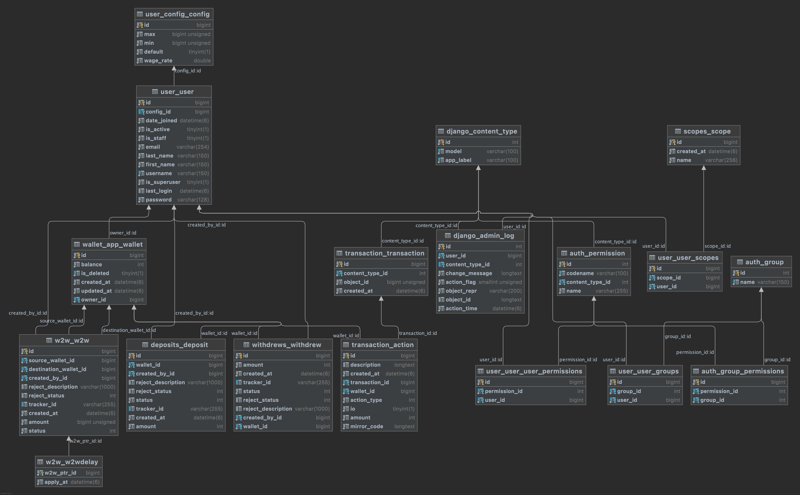

# Wallet Web Application
A web application to act as wallet service to handle client's Wallet in Microservices. Wallet app is responsible
to handle actions like deposit, withdraw, commission, delay deposit and etc on merchant wallets in IRR.
The real challenge in this project was handling concurrent/parallel requests during access to single wallet to 
prevent race condition (double spending), failure recovery for deposits and ,delayed deposits (saga pattern),
transaction history,  be extendable, alongside of be able to deploy as cluster with any number of nodes without
worry about parallel request issues. Current features are as follows:
- Instant deposit
- Delayed deposit
- Withdraw
- Wallet to Wallet transfer
- Wallet transactions history
- Handle commission dynamically
- Concurrent/Parallel safe
- Able to deploy in multiple nodes (clustering) via kubernetes, OpenShift, Docker Swarm, etc

## Dependencies/Tools
- Python v+3.10.X
- MySQL/Postgresql
- Redis
- Celery/Celery beat
- Gunicorn
- Docker/Docker Compose
- flake8/black
- JWT (also added ability to handle custom scopes too)

## Development
to run in development mode, be sure have running at least one desire db (RDBMS) and Redis on local machine. Also needs
to python +3.10 has been installed as virtualenv or global in your machine, then to have local config do:
```shell
cd /root/of/project
pip install -r requirements.txt
cp example.env .env
```
and fill `.env` variables with your local machine setup.<br>
Run django:
```shell
# activate python any way
cd /root/of/project
python manage.py runserver
```
Run celery:
```shell
cd /root/of/project
celery -A wallet.celery worker -l info -P solo  # we recommend to run in solo mode for development, be free to run in any other mode. 
```
Run celery beat:
```shell
celery -A wallet beat -l info
```

## Production
Using docker compose:
```shell
cd /root/of/project
docker compose up -d
```

## Test
```shell
cd /root/of/project
python manage.py test
```

## Diagram
UML diagram:<br>



## TODO
I plan to add following items/tools to current version:
- GitlabCI
- PreCommit
- Redis Pub/Sub
- Custom exception middleware/ DRF exceptions
- Locust for benchmark
- MemeCache
- RabbitMQ
- Poetry
